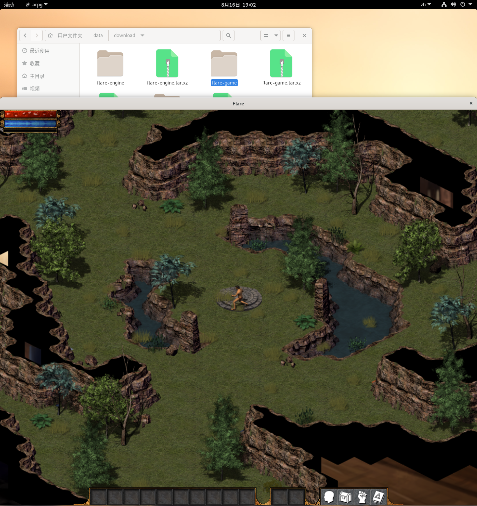
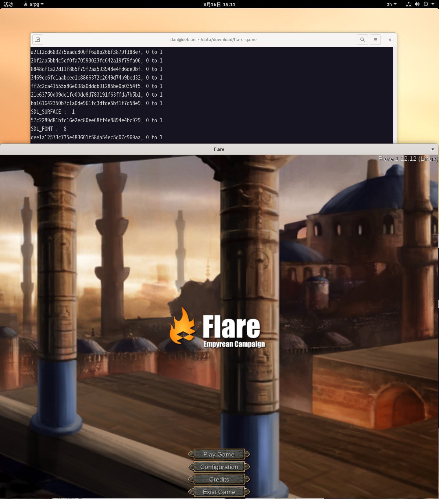
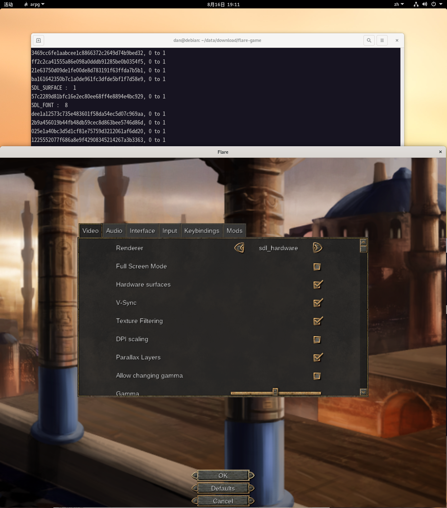

# monster
- golang和sdl写的2d游戏  
- 内部使用引用计数来关闭资源

参考c++项目: [flare](https://github.com/flareteam/flare-game)
 
## 安装
游戏资源安装，请参考: [flare](https://github.com/flareteam/flare-game)

## Debian
```sh
sudo apt-get install libsdl2-dev libsdl2-image-dev libsdl2-mixer-dev libsdl2-ttf-dev
```


## 游戏内
  
## 菜单
  

